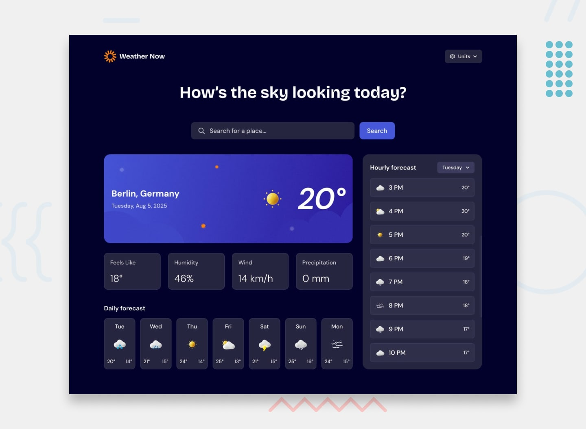

# Frontend Mentor - Weather app

## Welcome! 👋

## Frontend Mentor - Weather app solution

This is a solution to the Weather app challenge on Frontend Mentor
. Frontend Mentor challenges help you improve your coding skills by building realistic projects.

## Table of contents

## Overview

    1. The challenge

    2. Screenshot

    3. Links

## My process

    1. Built with

    2. What I learned

    3. Continued development

    4. Useful resources

## Author

## Acknowledgments

## Overview

## The challenge

Users should be able to:

- Search for weather information by entering a location

- View current weather conditions (temperature, weather icon, location details)

- See additional metrics: feels-like temperature, humidity, wind speed, and precipitation

- Browse a 7-day forecast with daily high/low temperatures and icons

- View an hourly forecast showing temperature changes

- Switch between different days of the week in the hourly forecast

- Toggle between Imperial and Metric units

- View optimal layouts depending on device size (responsive design)

- See hover and focus states for interactive elements

## Screenshot

## Links

Solution URL: https://github.com/POWELL-MWEEMBA/weather-app-main

Live Site URL: [Add live site URL here](https://powell-mweemba.github.io/weather-app-main/)

## My process

## Built with

1.  Semantic HTML5 markup

2.  CSS custom properties & Flexbox

3.  Mobile-first workflow

4.  JavaScript for DOM manipulation and API fetching

5.  OpenWeather API for weather data

## What I learned

While building this project I learned how to:

1.  Handle search form input with JavaScript

2.  Store and retrieve recent searches using localStorage

3.  Work with API requests using fetch()

4.  Implement responsive design patterns for different screen sizes

5.  Implementing state "loading, network error" etc

Example:

// Fetch weather data from OpenWeather
async function getWeather(city) {
const res = await fetch(
`https://api.openweathermap.org/data/2.5/weather?q=${city}&appid=YOUR_KEY&units=metric`
);
const data = await res.json();
console.log(data);
}

## Continued development

Going forward, I want to:

I 1. mprove error handling for invalid city names

    2. Add geolocation support (detect user’s current location)

    3. Polish the UI with better animations and transitions

    4. Expand the hourly forecast to be scrollable with touch gestures

## Useful resources

    1. OpenWeather Docs – Clear API docs for weather data

    2. MDN Web Docs – Helped me with fetch() and form handling

## Author

Frontend Mentor – @Powell Mweemba

## Acknowledgments

Thanks to the Frontend Mentor community for feedback and project inspiration.
